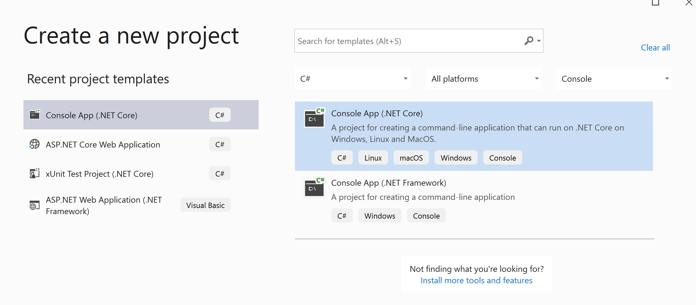
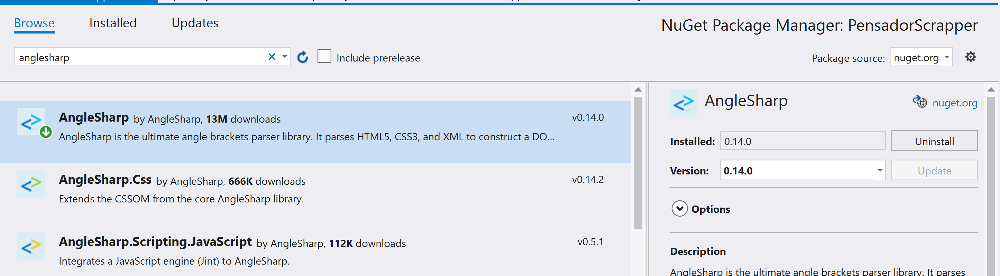
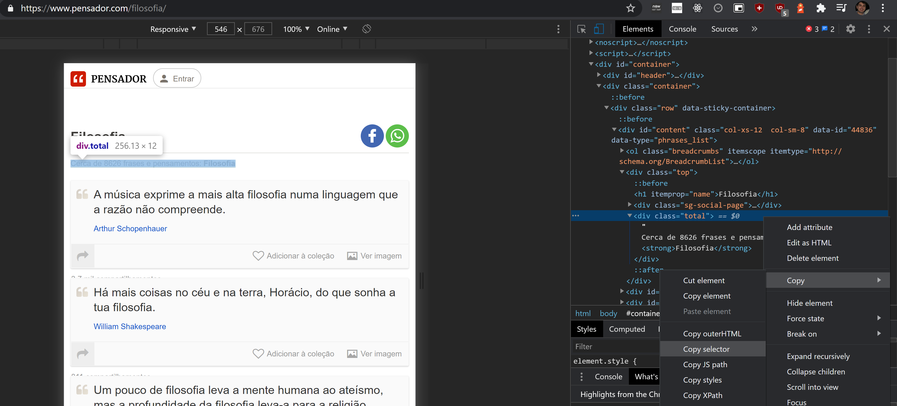
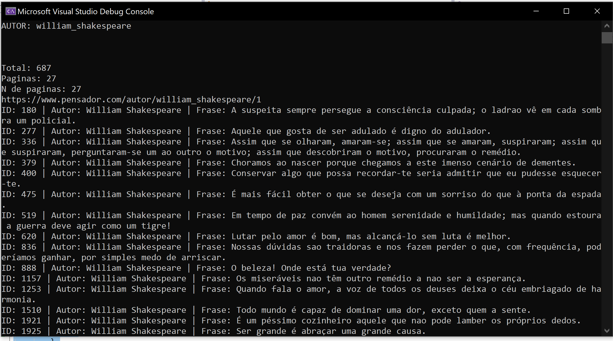
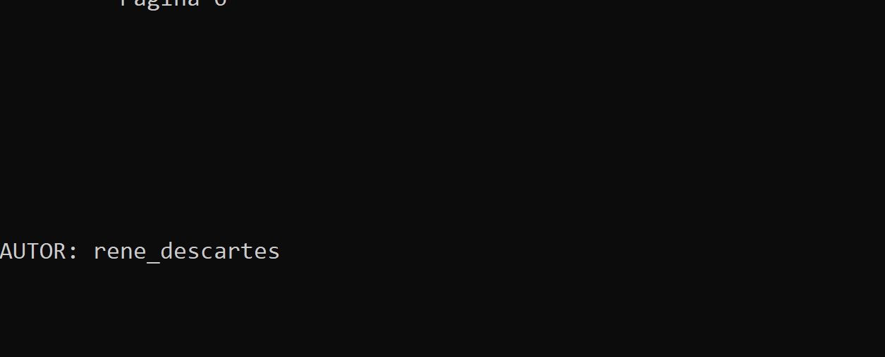

Recentemente tive a necessidade de buscar algumas informações em sites que não possuíam uma API para recuperar os dados necessários. Então, decidi que iria utilizar algumas técnicas de web scraping para buscar as informações que precisava. Já havia construído alguns web scrapers com Python e PHP. Porém, decidi me desafiar e criar um com .NET Core 3.1 e C#. Para isso utilizei um pacote, disponível no gerenciador de pacotes Nuget, chamado AngleSharp. Este pacote pode ser encontrado [aqui](https://www.nuget.org/packages/AngleSharp/1.0.0-alpha-827).

Para exemplificar aqui, vamos acessar o site [pensador.com](https://www.pensador.com/), e recuperar as citações que ficam disponíveis para visualização. Nosso objetivo então é **recuperar as citações de um determinado autor ou tema e armazenarmos em nosso dispositivo.**

## Criação do projeto

Minha necessidade era construir esse banco de citações uma vez, sem a necessidade de ficar atualizando ou ter algum acesso remoto. Por este motivo decidi criar uma aplicação de linha de comando, para isso utilizei o próprio template disponibilizado pelo Visual Studio. 



Após nomear o projeto e realizar sua criação, é necessário instalar o pacote AngleSharp como uma dependência do projeto. Para isso é necessário clicar com o botão direito do mouse em 'Dependencies', e selecionar a opção 'Manage NuGet Packages'. Você deve visualizar uma tela semelhante com a imagem abaixo:



Após clicar em instalar, nosso projeto está pronto para começarmos a realizar chamadas ao site.

## Acessando o site

Poderíamos realizar as chamadas diretamente no método Main da aplicação, mas eu prefiro separar em classes diferentes algumas operações. Sendo assim, decidi criar uma pasta Services e criar uma classe `ScrapperService.cs` dentro. Essa será a classe responsável por acessar o site que desejamos e trazer nossos dados já modelados.

Nessa classe `ScrapperService.cs` vamos criar uma propriedade do tipo `IBrowsingContext`, que é uma interface do pacote AngleSharp, que será responsável por fazer a requisição às páginas web que desejamos acessar. A classe junto com o seu construtor ficará assim:

```csharp
using AngleSharp;

namespace PensadorScrapper.Services
{
    class ScrapperService
    {
        private IBrowsingContext context { get; set; }

        public ScrapperService()
        {
            var config = Configuration.Default.WithDefaultLoader();
            context = BrowsingContext.New(config);
        }
    }
}
```

Nessa etapa já podemos escrever o método que irá realizar a leitura dos nossos dados de interesse, mas antes é importante abrirmos a página em nosso navegador para vermos como o DOM está organizado, para então organizarmos nossa estratégia de obtenção dos dados. Então, ao abrir a página inicial de algum tema de interesse podemos perceber a organização da página. Vou usar como exemplo citações com o tema de filosofia, a página pode ser visualizada abaixo:


Ao analisarmos dessa forma, conseguimos visualizar onde estão os elementos de interesse para nossa aplicação, que são: as citações e número total de citações. Necessitamos verificar o número total de citações para podermos calcular o número de páginas estimado que cada tema ou autor terá. Assim, conseguiremos extrair todas as citações de cada um. 

Após a análise visual é necessário verificar a organização do documento HTML, como já sabemos nossos elementos de interesse, podemos clicar com o botão direito e inspecionar o elemento para irmos direto a ele no código. Verificando o elemento, podemos então clicar com o botão direito novamente e selecionar a opção de copiar seletor. Esse caminho é que utilizaremos para encontrar esse elemento em nossa aplicação com o AngleSharp, então guarde ele em algum lugar. Abaixo uma imagem exemplificando o que foi realizado.



Realizando a mesma etapa para o bloco das citações, temos dois seletores copiados:

- Informação total de citações: #content > div.top > div.total
- Todas citações da página: #content > div.phrases-list

Com esses dados em mãos podemos criar o método para buscar as citações na classe `ScrapperService.cs`, o método fica assim:

```csharp
public async IAsyncEnumerable<Quote> GetQuotes(string assunto, int pagina)
        {
            var url = $"https://www.pensador.com/{assunto}/{pagina}";
            Console.WriteLine(url);
            var document = await context.OpenAsync(url);

            var quotesHtml = document.QuerySelectorAll("#content > div.phrases-list > .thought-card");
            
            foreach (var item in quotesHtml)
            {
                var autor = item.QuerySelector(".autor").Text();

                int id = int.Parse(item.GetAttribute("data-id"));

                var texto = item.QuerySelector(".frase").Text();

                if(item.QuerySelector(".insert-onlist") != null)
                {
                    continue;
                }

                yield return new Quote(id, autor.Trim(), texto.Trim());
            }
        }
```

Explicando o código acima:

- Criamos um método assíncrono para buscar as citações, pois assim nossa aplicação não fica bloqueada enquanto realiza uma chamada HTTP para o servidor, e também pois o pacote do AngleSharp realiza essa leitura da página de forma assíncrona.
- Como a lógica do método pode ser aplicada pra qualquer página ou tema, vamos passar esses dois parâmetros, tornando o método mais adaptável.
- Montamos então a url de acesso concatenando os textos conforme o padrão que o site utiliza, que é algum desses dois:
    - pensador.com.br**/tema/pagina**
    - pensador.com.br**/autor/nome_autor/pagina**

- Na linha com o código `var document = await context.OpenAsync(url);` é que realizamos a leitura do documento, com auxílio do pacote AngleSharp. Esse método nos retorna um objeto com a página mapeada onde é possível navegar através dos seus nós.
- Como já havíamos anotado nossos seletores, podemos utilizar a função QuerySelectorAll para retornar os nós de interesse nesse documento. Para isso então passamos o nosso seletor de todas as citações como parâmetro, adicionado da classe que todas citações compartilham em comum, como pode ser observado abaixo:
    - `var quotesHtml = document.QuerySelectorAll("#content > div.phrases-list > .thought-card");`
- Após termos todos os nós das citações, podemos iterar sobre eles e buscar as informações internas de cada nó. Para isso utilizamos novamente o QuerySelector, porém agora passando os seletores de cada informação que queremos. Que nesse caso são: autor, frase e ID.
- Como você pode perceber, esse método retorna um objeto Quote, e esse objeto deve ser criado por nós, para isso criei uma pasta Models, e então criei a classe modelo `Quote.cs`, que pode ser visualizada abaixo:

```csharp
namespace PensadorScrapper.Models
{
    class Quote
    {
        public int Id { get; set; }
        public string Autor { get; set; }
        public string Texto { get; set; }

        public Quote(int id, string autor, string texto)
        {
            Id = id;
            Autor = autor;
            Texto = texto;
        }
    }
}
```

- Dentro do laço então retornamos esse objeto Quote, com auxílio da palavra-chave `yield`, que fará com que as citações sejam retornadas assim que forem sendo recuperadas do site.

## E como descobrimos quantas páginas existem?

Se nós chamarmos o método construído acima, nossa aplicação já vai retornar todas citações de cada página que passarmos como parâmetro. Mas e se quisermos executar nossa aplicação para buscarmos todas as páginas de um tema ou autor? Para isso que salvamos o seletor daquela parte da página que nos informava o número total de posts. Porém, se analisarmos outra página, de algum autor específico, por exemplo, veremos que algumas informações estão diferentes:


O site pensador, quando tem um artista famoso, muda o texto de total de citações, e também muda a estrutura do HTML, para isso então precisamos mapear esse seletor também. Logo, temos dois seletores distintos:

- Artista Famoso: #content > div.autorTotal
- Tema geral: #content > div.top > div.total

Precisamos construir então um método que retorna o número total de páginas que cada autor ou tema terá. Uma forma simples de fazer isso é dividir o número total de citações pela quantidade que é exibida na primeira página, para termos um valor aproximado. Poderíamos também sempre analisarmos os elementos de paginação no final da página, até não existir mais nenhum. Mas nessa implementação vou somente dividir o número total de citações pelas exibidas na tela. Mas sintam-se livres para alterar o código no github e implementar essa funcionalidade. Segue abaixo como o método ficou:

```csharp
public async Task<int> GetTotalPages(string assunto)
        {
            
            var document = await context.OpenAsync($"https://www.pensador.com/{assunto}");

            var quotesHtml = document.QuerySelectorAll("#content > div.phrases-list > .thought-card");
            var textoTotal = "";
            
            int quantidadePorPagina;
            int total;
            
            if (document.QuerySelector("#content > div.top > div.total") != null)
            {
                textoTotal = document.QuerySelector("#content > div.top > div.total").Text();
                if (int.TryParse(Regex.Match(textoTotal, @"(?<=de )(.*)(?= pensamentos )").Value, out total))
                {
                    quantidadePorPagina = int.Parse(Regex.Match(textoTotal, @"(?<=-\n)(.\d)(?=)").Value);
                    total = int.Parse(Regex.Match(textoTotal, @"(?<=de )(.*)(?= pensamentos )").Value);
                }
                else
                {
                    total = int.Parse(Regex.Replace(textoTotal, @"[^\d]", ""));
                    quantidadePorPagina = quotesHtml.Count();
                }
            }
            else
            {
                total = int.Parse(document.QuerySelector("#content > div.autorTotal > strong:nth-child(2)").Text());
                var textoPagina = document.QuerySelector("#content > div.autorTotal > strong:nth-child(1)").Text();
                quantidadePorPagina = int.Parse(Regex.Match(textoPagina, @"(?<= )(.\d)(?=)").Value);
            }
            
            int paginas = total / quantidadePorPagina;

            Console.WriteLine("Total: " + total);
            Console.WriteLine("Paginas: " + paginas);

            return paginas;
        }
```

Esse método ficou um pouco extenso, e poderia ser otimizado, mas deixaremos para fazer isso em uma segunda versão. Para extrair as informações de total de citações e paginação utilizei Regex. Explicando de uma forma geral, o método acessa a primeira página do autor ou tema e verifica se está no padrão de totais de citação do tema ou autor, então utiliza as técnicas de QuerySelector para realizar a captura dos nós. Após isso, o valor total de citações é dividido pela quantidade de citações por página e armazenado em um inteiro para arredondarmos para baixo o total de páginas. 

## Acessando todas páginas de um tema específico ou autor

Agora que já possuímos um método para estimar o número total de páginas e outro método para buscar as citações dessa página, só necessitamos realizar um laço de repetição alterando a página até o total de página daquele autor ou tema. Para isso, podemos adicionar em nosso método Main da classe `Program.cs` . A classe fica assim:

```csharp
using PensadorScrapper.Services;
using System;

namespace PensadorScrapper
{
    class Program
    {
        static async System.Threading.Tasks.Task Main(string[] args)
        {
            ScrapperService scrapper = new ScrapperService();
            
            string assunto = "autor/william_shakespeare";

            Console.WriteLine($"\n\n\n\n\n\nAUTOR: william_shakespeare \n\n\n");
                
            var totalPaginas = await scrapper.GetTotalPages(assunto);
            Console.WriteLine("N de paginas: " + totalPaginas);

            for (var i = 1; i <= totalPaginas; i++)
            {
                await foreach (var quote in scrapper.GetQuotes(assunto, i))
                {
                    Console.WriteLine($"ID: {quote.Id} | Autor: {quote.Autor.Trim()} | Frase: {quote.Texto.Trim()}");
                }
                Console.WriteLine($"\n --------Página {i}--------- \n\n");
            }
        }
    }
}
```

Ao executarmos o código podemos ver como está funcionando nossa aplicação:



Ainda, se desejarmos buscar dados de mais de um autor ou tema poderíamos criar uma Lista de autores e iterar sobre ela chamando os nossos mesmos métodos, dessa maneira:

```csharp
using PensadorScrapper.Models;
using PensadorScrapper.Services;
using System;
using System.Collections.Generic;

namespace PensadorScrapper
{
    class Program
    {
        static async System.Threading.Tasks.Task Main(string[] args)
        {
            ScrapperService scrapper = new ScrapperService();
            
            List<string> autores = new List<string>{
                "jean_jacques_rousseau",
                "rene_descartes",
                "immanuel_kant",
                "john_locke",
                "blaise_pascal",
                "galileu_galilei",
                "michel_de_montaigne",
                "mary_wollstonecraft",
                "angela_davis",
                "hipatia_de_alexandria",
                "maquiavel",
                "adam_smith",
                "zygmunt_bauman",
                "baruch_espinosa",
                "friedrich_engels",
                "georg_wilhelm_friedrich_hegel",
                "soren_kierkegaard",
                "epicteto",
                "martin_heidegger",
                "michel_foucault",
                "martin_heidegger",
                "hannah_arendt"
            };

            foreach (var autor in autores)
            {
                string assunto = "autor/"+autor;

                Console.WriteLine($"\n\n\n\n\n\nAUTOR: {autor} \n\n\n");
                
                var totalPaginas = await scrapper.GetTotalPages(assunto);
                Console.WriteLine("N de paginas: " + totalPaginas);

                for (var i = 1; i <= totalPaginas; i++)
                {
                    await foreach (var quote in scrapper.GetQuotes(assunto, i))
                    {
                        Console.WriteLine($"ID: {quote.Id} | Autor: {quote.Autor.Trim()} | Frase: {quote.Texto.Trim()}");
                        QuotesRepository.SaveQuote(quote);
                    }
                    Console.WriteLine($"\n --------Página {i}--------- \n\n");
                }
            }
            
            
        }
    }
}
```

## Conclusão

Pronto! Temos uma aplicação que realiza um Web scraping no site pensador.com e retorna todas as citações disponíveis de um determinado autor ou tema. Claro que normalmente não é só isso que desejamos. Muitas vezes necessitamos armazenar essas informações. Por esse motivo eu já realizei também a integração dessa aplicação com um banco de dados, onde essas informações ficam armazenadas. Mas como o post já ficou extenso, vou tratar desta etapa em um outro post aqui. Utilizaremos SQLite para armazenar e recuperar esses dados. O código completo desse post, com a versão já utilizando o banco de dados pode ser encontrado no meu [Github](https://github.com/lucaspsilveira/PensadorScrapper). Abaixo temos um GIF da aplicação funcionando:

