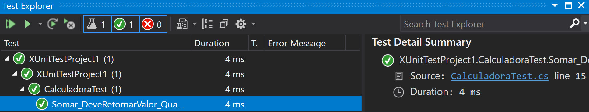

##Sobre testes unitários

Testes unitários são aqueles onde é possível verificar a execução da menor parte testável do seu código. Geralmente essa parte é uma função ou um método. Utilizar a automação desses testes é crucial para garantirmos que o código realize aquilo que nós desenvolvedores esperamos. 

Assim, devemos escrever nossos testes em um cenário limitado e específico. Testes mais complexos e que abrangem mais funcionalidades devem ser realizados através de testes de integração e serviços. Assim, os testes unitários devem certificar os códigos dentro do seu controle, abstraindo as questões de infraestrutura.

Acredito que realizando tarefas práticas é o melhor modo de compreender, então vamos ao código!

##Criando nosso primeiro teste

Nesse exemplo irei demonstrar os testes unitários com .NET Core 3.1 e xUnit.
O primeiro passo é criarmos um projeto, pode ser uma aplicação de linha de comando para testarmos alguns métodos. Irei utilizar o Visual Studio 2019 para os exemplos. Ao criarmos nosso projeto, devemos ter uma classe Program, com esse conteúdo: 


```
using System;

namespace UnitTestsNetCore
{
    class Program
    {
        static void Main(string[] args)
        {
            Console.WriteLine("Hello World!");
        }
    }
}
```
Para exemplificar a realização dos testes, vamos criar uma abstração de uma calculadora. Essa calculadora terá 4 métodos: 
- Somar(decimal Num1, decimal Num2)
- Subtrair(decimal Num1, decimal Num2)
- Multiplcar(decimal Num1, decimal Num2)
- Dividir(decimal Num1, decimal Num2)

Para simplificar, cada método retornará o resultado apenas, logo nossa calculadora não terá um estado que armazenará os resultados. Nossa classe calculadora será apenas responsável por executar os métodos e retornar esse valor. No final temos uma classe com o conteúdo abaixo:
```
namespace UnitTestsNetCore
{
    class Calculadora
    {
        public decimal Somar(decimal Num1, decimal Num2) => Num1 + Num2;
        public decimal Subtrair(decimal Num1, decimal Num2) => Num1 - Num2;
        public decimal Multiplicar(decimal Num1, decimal Num2) => Num1 * Num2;
        public decimal Dividir(decimal Num1, decimal Num2) => Num1 / Num2;
    }
}
```

Agora que já temos nossa calculadora, podemos criar nossa classe de testes! Para isso utilizei o Visual Studio para criar um novo projeto do tipo XUnitTest na mesma solução. Então vamos adicionar o primeiro projeto que criamos como referência para este último. Para realizar isto basta adicionar este item no arquivo .csproj.
```
<ItemGroup>
    <ProjectReference Include="..\UnitTestsNetCore\UnitTestsNetCore.csproj" />
</ItemGroup>
```

Vamos criar então nossa classe de testes, e nela vamos instanciar a classe que desejamos em seu construtor (Calculadora). Após fazer isso já podemos escrever nosso primeiro teste. A classe de testes ficará assim:

```
using Xunit;
using UnitTestsNetCore;

namespace XUnitTestProject
{
    public class CalculadoraTest
    {
        private readonly Calculadora _sut;
        public CalculadoraTest()
        {
            _sut = new Calculadora();
        }

        [Fact]
        public void Somar_DeveRetornarValor_QuandoInformadoAmbosNumeros()
        {
            
            var resultado = _sut.Somar(1, 2);
            Assert.Equal(3, resultado);
        }
    }
}
```

Nesse momento, nós temos nossa classe Calculadora como uma propriedade da nossa classe de testes, e podemos utilizar ela em todos os testes que desejarmos. Para definirmos algum método como um método de testes precisamos adicionar o atributo [Fact], na linha acima do método. Desse modo o xUnit saberá que esse método é um teste e deve ser chamado. No conteúdo do método temos a execução da função Somar(). Na última linha, verificamos se a função ocorreu como esperado. O primeiro parâmetro é o valor esperado e o segundo o valor atual que temos de retorno. Se executarmos os testes, tudo deve ocorrer sem nenhuma falha. Como pode ser visto abaixo:

 

Antes de escrevermos mais testes, se olharmos para o nosso método veremos que ele está testando somente um cenário. Que é a soma de 1 e 3. Para testarmos diferentes cenários no mesmo método, podemos mudar o atributo [Fact] para [Theory]. Ao realizar isso, precisamos também passar quais os cenários que desejamos, para isso utilizaremos o atributo [InLineData(params)]. Cada [InLineData(params)] que colocarmos, o xUnit irá realizar um teste. Vamos alterar para Theory e alterar o nosso método para aceitar 3 parâmetros. Precisamos informar qual o valor esperado e os dois valores para soma. Então o código ficará assim: 
```
[Theory]
[InlineData(3, 2, 1)]
[InlineData(1, 2, -1)]
[InlineData(20, 20, 0)]
public void Somar_DeveRetornarValor_QuandoInformadoAmbosNumeros(decimal esperado,
                                                                decimal Num1,
                                                                decimal Num2)
{
    var resultado = _sut.Somar(Num1, Num2);
    Assert.Equal(esperado, resultado);
}
```

Ao rodarmos os nossos testes, a função será executada 3 vezes com os parâmetros definidos nos [InLineData(params)]. O retorno no Visual Studio ficará assim: 

 

A biblioteca xUnit possui diversas funcionalidades para testarmos os nossos códigos que vão além de verificar se o retorno é igual ou diferente. Podemos verificar logs, status de requisições, conteúdos, e inúmeras outras funcionalidades. Podemos configurar se os testes irão rodar em paralelo ou não, definirmos se a classe que está sendo testada será ou não compartilhada entre os testes, as possibilidades são enormes. Aqui está somente o básico de como testar uma função, recomendo fortemente a leitura dos materiais de referência que coloquei no final do post.

O próximo post então será mais rápido e irá explicar algumas outras possibilidades um pouco mais avançadas utilizando xUnit e Mocks.

O código do final do projeto, com os testes dos outros métodos, pode ser encontrado aqui: [Github](https://github.com/lucaspsilveira/testes-dotnetcore-blog) 
##Referências
* [Unit Test Microsoft](https://docs.microsoft.com/pt-br/dotnet/core/testing/unit-testing-with-dotnet-test)
* [Video aula no youtube](https://www.youtube.com/watch?v=2Wp8en1I9oQ)
* [Documentação xUnit](https://xunit.net/)
